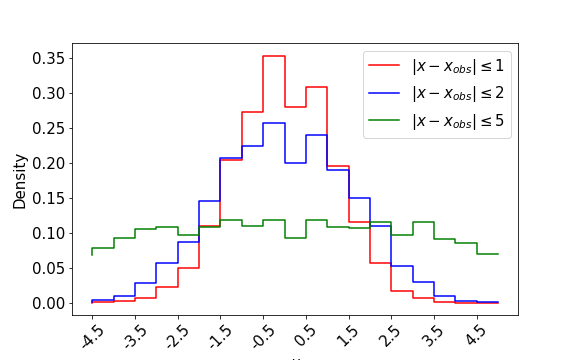

# Leveraging Gradient Information to Optimise Supervised Learning Model Prediction and Complexity

 ## Approximate Bayesian Computation (ABC) example
[Approximate Bayesian Computation example.ipynb](ABC_example/Approximate%20Bayesian%20Computation%20example.ipynb) demonstrates the method behind ABC using a 1D gaussian as an example process with the mean as a single latent parameter, discussed in Section 1.2.1. As the tolerance of accepted samples increases, the posterior `p(θ|x)` density becomes less concentrated around the true value 0 and approachs the uniform prior.  

## Ridge-Gradients regularisation method
[Ridge-Gradients regularisation example.ipynb](Regularising%20regression%20with%20gradients/Ridge-Gradient%20regularisation%20example.ipynb) demonstrates the Ridge-Gradients regularisation method for linear regression, presented in Section 2.2.1. The Ridge-Gradient method levearges derivatives of the target varaible with respect to model inputs to improve model accuracy relative to standard Ridge regularisation. The left figure compares the test RMSE of a linear model fit with OLS with Ridge regularisation and OLS with Ridge-Gradients regularisation over varying training sizes. The right figure shows the percentage difference between the models performance (positive difference indicates Ridge-Gradient method outperfoms).

 
 
 
 
 
 
 
 
 

## Leveraging gradients for surrogate modelling 
Full code for all experiments along with saved models can be found in the [public google drive](https://drive.google.com/drive/folders/1J7srZbZPS6UhE43GFXP3Gkd3TmEvT-6f?usp=sharing)

This repository contains example code that shows how surrogatae training and evaluation was conducted along with latent parameter inference code.
### 2D toy problem

[2D_generate_data.ipynb](Toy%20problems/2D/2D_generate_data.ipynb) generates data from the 2D process presented in Section 3.2.1 which is saved in [2d_data](Toy%20problems/2D/2d_data).

[2D_surrogate_AccTest_nTrain50_EXAMPLE.ipynb](Toy%20problems/2D/2D_surrogate_AccTest_nTrain50_EXAMPLE.ipynb) contains the code used to train and evaluate surrogate model accuracy, comparing the performance of neural networks trained with and without gradients. The results are discussed in Section 3.2 and show gradient trained surrogates are more accurate for small sample sizes and low model complexities. 

 
 
 
 
 
 
 
 
 

[MLE and MH latent parameter inference 2D problem.ipynb](Toy%20problems/2D/MLE%20and%20MH%20latent%20paramater%20inference%202D%20problem.ipynb) contains the code used to utilise the surrogate models in an inference pipeline under maximum likelihood estimation and Metropolis-Hastings sampling. Results are discussed in Section 3.2.2 and principally show improved latent parameter estimation using gradient traing surrogates for small smaple sizes.

 
 
 
 
 
 
 
 
 

### 4D GARCH problem

[4D_generate_data.ipynb](Toy%20problems/4D/4D_generate_data.ipynb) generates data from the 4D process presented in Section 3.3.1 which is saved in [4d_data](Toy%20problems/4D/4d_data).

[4D_surrogate_AccTest_nTrain100_EXAMPLE.ipynb](Toy%20problems/4D/4D_surrogate_AccTest_nTrain100_EXAMPLE.ipynb) contains the code used to train and evaluate surrogate model accuracy, comparing the performance of neural networks trained with and without gradients. The results are discussed in Section 3.3 and show gradient trained surrogates are more accurate for small sample sizes and low model complexities. 

 
 
 
 
 
 
 
 
 

[garch_s&p_nTrain100.ipynb](Toy%20problems/4D/garch_s%26p_nTrain100.ipynb) contains the code used to utilise the surrogate models in an inference pipeline under maximum likelihood estimation to estimate S&P 500 daily volatility. Results are discussed in Section 3.3.3 and show improved latent parameter estimation using gradient traing surrogates for small sample sizes.

 
 
 
 
 
 
 
 
 

### 8D problem
[generate_data_8D.ipynb](Toy%20problems/8D/generate_data_8D.ipynb) generates data from the 8D process presented in Section 4.1.1 which is saved in [8d_data](Toy%20problems/8D/8D_data).

[8D_surrogate_AccTest_nTrain2500_EXAMPLE.ipynb](Toy%20problems/8D/8D_surrogate_AccTest_nTrain2500_EXAMPLE.ipynb) contains the code used to train and evaluate  model accuracy. The 8D model is used in addition to the 2D and 4D models to support the delta-min metric discussed in Section 4.1. 

## Tuning model complexity
### Determining complexity upper bound
[Optimsing model complexity with gradient information.ipynb](Tuning%20model%20complexity/Optimising%20model%20complexity%20with%20gradient%20information.ipynb) presents the code used to compute the delta-min metric to determine an upperbound for neural networkw complexity, as discussed in Section 4.1.

 
 
 
 
 
 
 
 
 

 
 
 
 
 
 
 
 
 

